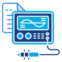

#  OWON Binfile Reader

This is a simple library, available as [NuGet package](https://www.nuget.org/packages/OwonBinfileReader/), to read OWON oscilloscope binfiles. Most of the code is based on reverse engineering and guestimating so don't use this to build a nuclear powerplant or send people into space with!

 [](https://www.nuget.org/packages/OwonBinfileReader/)

## Usage
```c#
using OwonBinfileReader;

var bfr = new BinfileReader();
var bf = await bfr.ReadAsync(@"/path/to/file.bin");
```

This will read the binfile and return a `Binfile` object. This object contains the following properties:

- [`MetaData`](OwonBinfileReader/Channel.cs): contains information about the oscilloscope settings and binfile.
- `Measurements`: this is an `ReadOnlyDictionary<int, double[]>`) and contains the measurements per ('displayed') channel.

## Tested oscilloscopes

For now this library has only been tested with the `Hanmatek DSO1102` which is a rebranded version of the `OWON SDS1102` as far as I know and a `OWON XDS3104AE`. I have found some other `.bin` files online which worked as well, but you'll have to see for yourself if this library works for you.

## File format

The following is a description of the file format as I have reverse engineered it. The file format is a binary file with the following structure:

Offset | Bytes | Value | Meaning
---|---|---|---
0 | 6 | `SPBXDS` | Magic header (might be `SPBX` + `DS` where `DS` has some meaning)
6 | 4 | JSON length | DWORD Signed integer length of following JSON data
10 | Json Length | JSON data | Contains metadata about the file
10 + Json Length | 4 | Data Length | DWORD Signed integer length of data segment
14 + Json Length | Data length | Data | WORD Signed integer values repeated Data Length / 2 times (because each value is 2 bytes)

This `Data Length` + `Data` repeats for each channel where `DISPLAY` is `ON`. Then finally an optional segment may follow after the data (End Of Data):

Offset | Bytes | Value | Meaning
---|---|---|---
EOD | 4 | `INFO` | Additional information
EOD + 4 | 4 | Unknown | DWORD Unknown value
EOD + 8 | 4 | Unknown | DWORD Unknown value
EOD + 12 | 19 | Date | ISO8601 Date (YYYY-MM-DD HH:MM:SS)
EOD + 31 | 11 | Unknown | Unknown / all zeroes

The above segment is not read by this library.

An example of the JSON contained in this file might be:

```json
{
  "TIMEBASE": {
    "SCALE": "200ms",
    "HOFFSET": 120
  },
  "SAMPLE": {
    "FULLSCREEN": 1520,
    "SLOWMOVE": 2000,
    "DATALEN": 1520,
    "SAMPLERATE": "(2.5MS/s)",
    "TYPE": "SAMPle",
    "DEPMEM": "10M"
  },
  "CHANNEL": [
    {
      "NAME": "CH1",
      "DISPLAY": "ON",
      "Current_Rate": 10000,
      "Current_Ratio": 0.78125,
      "Measure_Current_Switch": "OFF",
      "COUPLING": "DC",
      "PROBE": "10X",
      "SCALE": "50.0mV",
      "OFFSET": -201,
      "FREQUENCE": 210.14742,
      "INVERSE": "OFF"
    },
    {
      "NAME": "CH2",
      "DISPLAY": "OFF",
      "Current_Rate": 10000,
      "Current_Ratio": 0.015625,
      "Measure_Current_Switch": "OFF",
      "COUPLING": "DC",
      "PROBE": "10X",
      "SCALE": "1.00mV",
      "OFFSET": 0,
      "FREQUENCE": 210.14742,
      "INVERSE": "OFF"
    },
    {
      "NAME": "CH3",
      "DISPLAY": "OFF",
      "Current_Rate": 10000,
      "Current_Ratio": 0.015625,
      "Measure_Current_Switch": "OFF",
      "COUPLING": "DC",
      "PROBE": "10X",
      "SCALE": "1.00mV",
      "OFFSET": 0,
      "FREQUENCE": 210.14742,
      "INVERSE": "OFF"
    },
    {
      "NAME": "CH4",
      "DISPLAY": "OFF",
      "Current_Rate": 10000,
      "Current_Ratio": 0.015625,
      "Measure_Current_Switch": "OFF",
      "COUPLING": "DC",
      "PROBE": "10X",
      "SCALE": "1.00mV",
      "OFFSET": 0,
      "FREQUENCE": 210.14742,
      "INVERSE": "OFF"
    }
  ],
  "DATATYPE": "SCREEN",
  "RUNSTATUS": "SCAN",
  "IDN": "OWON,XDS3104AE,2308149,V4.0.0",
  "MODEL": "310401101",
  "Trig": {
    "Mode": "SINGle",
    "Type": "EDGE",
    "Items": {
      "Channel": "CH1",
      "Level": "2.50V",
      "Edge": "RISE",
      "Coupling": "DC",
      "HoldOff": "100ns"
    },
    "Sweep": "AUTO"
  },
  "IsSkipIfClosed": true
}
```

The actual measurement is each 16 bit value × (CurrentRatio / CurrentRate).

## Normalization

This library will normalize values to the base unit. So values in `mV` will be converted to `V`, values in `µs` will be converted to `s`, etc. Where possible values are parsed to enums (e.g. `Coupling` or `Triggermode`), `bools` for `ON` / `OFF` values, timespans etc. Values are represented in the `double` datatype.

## TestApp

This repository contains a [TestApp](TestApp) which is a simple console application to demonstrate the library. It scans given directory / directories and reads the binfiles contained and outputs (some of) the metadata to the console and also converts the file into a CSV file.

## Attribution

The logo is composed of the following images:

* [Papers Icon by Shahid-Mehmood](https://www.freepik.com/icon/papers_12903330)
* [Oscilloscope Icon by Muhammad Ali](https://www.freepik.com/icon/oscilloscope_7237705)